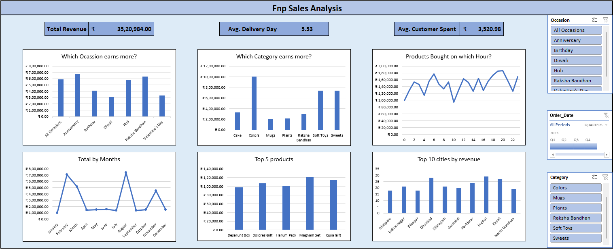
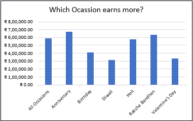
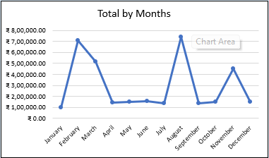
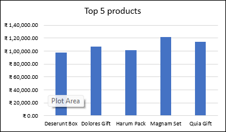

# FNP Sales Analysis Dashboard

## Project Overview
This project analyzes FNP sales data using Microsoft Excel to uncover meaningful insights into revenue trends, customer purchasing behavior, and product performance. The dashboard is designed to help stakeholders make data-driven decisions by exploring sales across occasions, categories, time periods, and locations.

---

## Key Metrics
- Total Revenue: ₹35,20,984  
- Average Delivery Time: 5.53 days  
- Average Customer Spend: ₹3,520.98  

---

## Features
- Occasion-wise revenue analysis to identify high-performing events such as festivals and special days  
- Category-wise performance comparison to understand which product segments generate the most sales  
- Hourly order trend analysis to identify peak purchasing times during the day  
- Monthly sales trends to highlight seasonality and demand fluctuations  
- Top products analysis to identify best-selling items contributing most to revenue  
- City-wise revenue distribution to recognize high-performing geographic regions  
- Interactive filters to dynamically explore data by Occasion, Date, and Category  

---

## Dashboard Preview 

---

## Key Insights
- Occasions such as Anniversary and Raksha Bandhan consistently generate higher revenue compared to others  
- Categories like Colors and Sweets contribute a significant portion of total sales  
- Sales exhibit clear seasonal patterns, with noticeable spikes during certain months  
- A small group of top-performing products drives a large share of overall revenue  

---

## Graph Explanation

### Occasion-wise Revenue (Bar Chart)
This chart shows how revenue varies across different occasions. It helps identify which events generate the highest sales. From the dashboard, occasions like Anniversary and Raksha Bandhan stand out as key revenue drivers, indicating strong seasonal demand.

### Monthly Sales Trend (Line Chart)
This graph represents revenue trends over different months. It highlights seasonal patterns and demand fluctuations. Peaks in certain months suggest the influence of festivals and special events on customer purchasing behavior.

### Top Products (Bar Chart)
This chart displays the top-performing products based on revenue. It shows that a small number of products contribute significantly to total sales, helping businesses focus on high-performing items for marketing and inventory planning.

---

## Predictions
- Revenue is expected to continue peaking during major occasions, making them crucial for targeted marketing and promotions  
- High-performing products are likely to remain the primary contributors to total sales unless new products are introduced strategically  
- Sales trends will continue to follow seasonal patterns, allowing better forecasting and inventory planning  

---

## Tools Used
- Microsoft Excel (Data Cleaning, Analysis, and Dashboard Creation)  

---

## Business Value
This dashboard helps in:
- Identifying high-revenue occasions for better marketing planning  
- Understanding customer purchase patterns to improve targeting  
- Optimizing inventory based on seasonal demand  
- Focusing on top-performing products and cities to maximize revenue  

---

## How to Use
1. Open the Excel dashboard file  
2. Use available filters to explore data  
3. Analyze trends across different dimensions  

---

## Author
Aryan Prakash Pilwalkar 

LinkedIn: www.linkedin.com/in/aryanpilwalkar